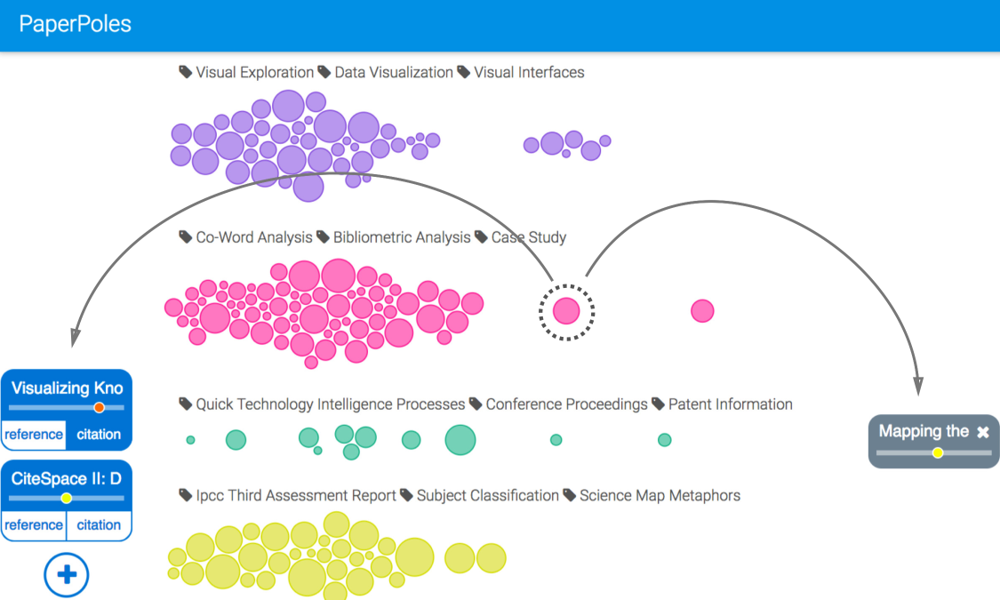

# PaperPoles: Facilitating Adaptive Visual Exploration of Scientific Publications by Citation Links

[Paper (pdf)](/pdf/paperpoles.pdf) | [Website](/paperpoles)

## Abstract
Finding relevant publications is a common task. Typically, a researcher browses through a list of publications and traces additional relevant publications. When relevant publications are identified, the list may be expanded by the citation links of the relevant publications. The information needs of researchers may change as they go through such iterative processes. The exploration process quickly becomes cumbersome as the list expands. Most existing academic search systems tend to be limited in terms of the extent to which searchers can adapt their search as they proceed. In this paper, we introduce an adaptive visual exploration system named PaperPoles to support exploration of scientific publications in a context-aware environment. Searchers can express their information needs by intuitively formulating positive and negative queries. Search results are grouped and displayed in a cluster view, which shows aspects and relevance patterns of the results to support navigation and exploration. We conducted an experiment to compare PaperPoles with a list-based interface in performing two academic search tasks with different complexity. The results show that PaperPoles can improve the accuracy of searching for the simple and complex tasks. It can also reduce completion time of searching and exploration effectiveness in the complex task. PaperPoles demonstrates a potentially effective workflow for adaptive visual search of complex information.

