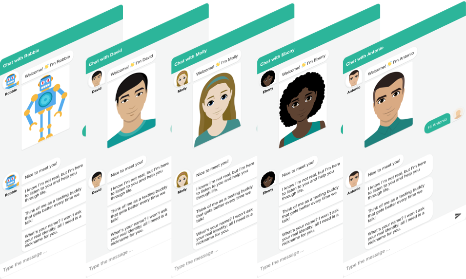

# Racial Mirroring Effects on Human-agent in Psychotherapeutic Conversation

[**Paper (pdf)**](../pdf/racial-mirroring.pdf)

## Introduction

Conversational agents are increasingly utilized to deliver mental health services. Although these intelligent systems promise more affordable mental healthcare, one critical challenge is patient adherence. Our study explores the “racial mirroring” effects on people's engagement with and perception of agents in the context of psychotherapy. We developed a conversational system with racially heterogeneous personas using strong visual cues. We conducted an experiment by randomly assigning participants (N=212) to racial mirroring, non-mirroring and control groups. Our results suggest that racial mirroring did influence people’s perceived interpersonal closeness with agents, use satisfaction, disclosure comfort, desire to continue interacting, and projected future relationship. In this study, we present the conversational system, experimental procedure and results. We conclude with design recommendations for employing conversational agents in mental health intervention.

## Chatbot Agents
we created nine racially diverse agents.

- [Molly (White/Caucasian female)](http://jiangenhe.com/chatbot/?BOT_CODE=WF)
- [Jake (White/Caucasian male)](http://jiangenhe.com/chatbot/?BOT_CODE=WM)
- [Ebony (Black/African American female)](http://jiangenhe.com/chatbot/?BOT_CODE=BF)
- [Darnell (Black/African American male)](http://jiangenhe.com/chatbot/?BOT_CODE=BM)
- [Jenny (Asian female)](http://jiangenhe.com/chatbot/?BOT_CODE=AF)
- [David (Asian male)](http://jiangenhe.com/chatbot/?BOT_CODE=AM)
- [Camila (Hispanic female)](http://jiangenhe.com/chatbot/?BOT_CODE=HF)
- [Antonio (Hispanic male)](http://jiangenhe.com/chatbot/?BOT_CODE=HM)
- [Robbie (non-personified and gender-neutral agent)](http://jiangenhe.com/chatbot/?BOT_CODE=BL)
