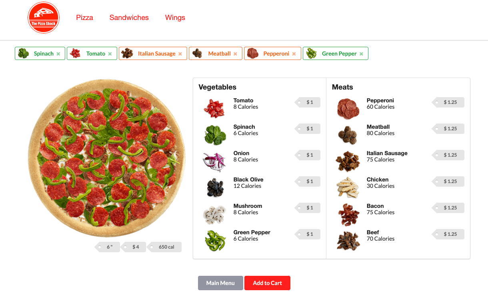

# Understanding Consumers’ Product Decisions When Shopping by Voice

 

Many e-retailers are beginning to offer artificially intelligent virtual assistants on their websites (e.g., Amazon Alexa, Domino's DRU assist), allowing consumers to place an order by speaking, texting, or clicking. We propose that engaging in voice-based interactions will encourage consumers to purchase more recommended products as opposed to the other response modalities. Voice-based interactions carry more social functions than text- and click-based interactions, and this social inclination evokes people’s anthropomorphism tendencies. As a result, consumers are more likely to comply with a recommendation to purchase products. This effect is only observed in two-way dialogues, in which consumers obtain social responses from the computer reciprocally, but not in one-way monologues, where a social response from the computer is missing. Five studies using an online food-ordering website are conducted to test the hypotheses.

We developed different interfaces to examine the role of both the consumer’s and the computer’s modalities during the interaction process.

## Videos

- \[Demo-1\] [Baseline-Click Website](https://vimeo.com/334505702) (Click-based interaction without social response from computer) 
- \[Demo-2\] [Text-Type Website](https://vimeo.com/334506760) (Text-based interaction with interactive text from computer) 
- \[Demo-3\] [Voice-Speak Website](https://vimeo.com/334506829) (Voice-based interaction with synthesized voice from computer)

## Website versions

<table class="alt">
  <tr>
    <td colspan="2" rowspan="2"></td>
    <td colspan="4"><strong>Computer's Response Modality</td>
  </tr>
  <tr>
    <td><strong>No Text</strong></td>
    <td><strong>Interactive Text</strong></td>
    <td><strong>Synthesized Voice</strong></td>
  </tr>
  <tr>
    <td rowspan="3"><strong>Consumer's  Communication  Modality</strong></td>
    <td><strong>Click</strong></td>
    <td><a href="https://www.cs.drexel.edu/~jh3328/voice-shopping/?Experiment=BASELINE">click-none</a></td>
    <td><a href="https://www.cs.drexel.edu/~jh3328/voice-shopping/?Experiment=TEXT_CLICK_FREE"> click-text</a></td>
    <td><a href="https://www.cs.drexel.edu/~jh3328/voice-shopping/?Experiment=VOICE_CLICK_FREE"> click-voice</a></td>
  </tr>
  <tr>
    <td><strong>Type</strong></td>
    <td></td>
    <td><a href="https://www.cs.drexel.edu/~jh3328/voice-shopping/?Experiment=TEXT_TEXT_RIGID">type-text</a></td>
    <td><a href="https://www.cs.drexel.edu/~jh3328/voice-shopping/?Experiment=VOICE_CLICK_RIGID">type-voice</a></td>
  </tr>
  <tr>
    <td><strong>Speak</strong></td>
    <td></td>
    <td><a href="https://www.cs.drexel.edu/~jh3328/voice-shopping/?Experiment=TEXT_SPEAK_RIGID">speak-text</a></td>
    <td><a href="https://www.cs.drexel.edu/~jh3328/voice-shopping/?Experiment=VOICE_SPEAK_RIGID"><strong>speak-voice</strong></a></td>
  </tr>
</table>

## Website Specification

- [click-none](https://www.cs.drexel.edu/~jh3328/voice-shopping/?Experiment=BASELINE) 
    - Website is navigated by clicking 
    - No extra text information on website
- [click-text](https://www.cs.drexel.edu/~jh3328/voice-shopping/?Experiment=TEXT_CLICK_FREE)
    - Website is navigated by clicking 
    - Website provides interactive text information to users
- [click-voice](https://www.cs.drexel.edu/~jh3328/voice-shopping/?Experiment=VOICE_CLICK_FREE)
    - Website is navigated by clicking 
    - Website provides synthesized voice information to users

- [type-text](https://www.cs.drexel.edu/~jh3328/voice-shopping/?Experiment=TEXT_TEXT_RIGID)
    - Website is navigated by typing
    - Website provides interactive text information to users
- [type-voice](https://www.cs.drexel.edu/~jh3328/voice-shopping/?Experiment=VOICE_CLICK_RIGID)
    - Website is navigated by typing
    - Website provides synthesized voice information to users
    
    
- [speak-text](https://www.cs.drexel.edu/~jh3328/voice-shopping/?Experiment=TEXT_SPEAK_RIGID)
    - Website is navigated by speaking 
    - Website provides interactive text information to users
- [speak-voice](https://www.cs.drexel.edu/~jh3328/voice-shopping/?Experiment=VOICE_SPEAK_RIGID)
    - Website is navigated by speaking
    - Website provides synthesized voice information to users

